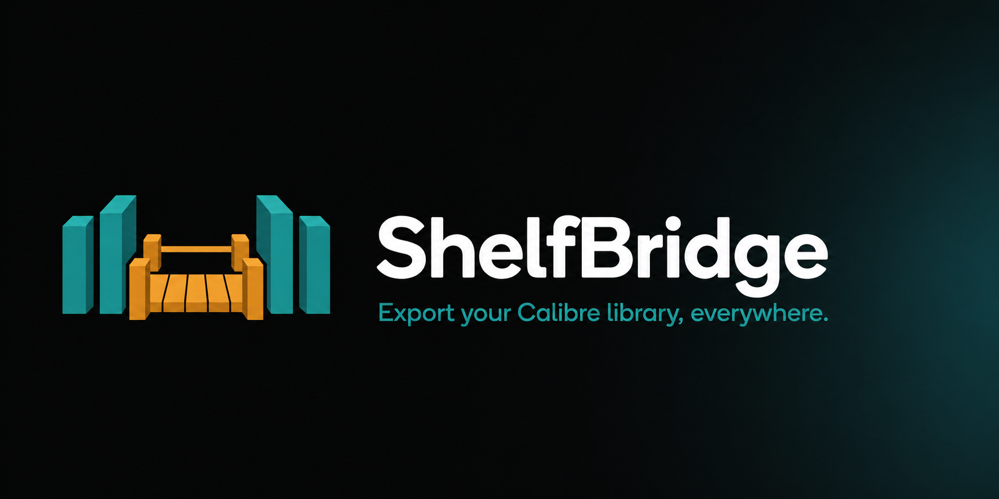
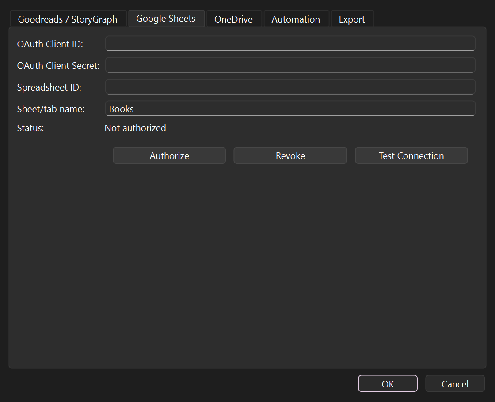

<p align="center">
  
</p>

# ShelfBridge

[](https://github.com/sponsors/kaylaehman)
[](LICENSE)

A [Calibre](https://calibre-ebook.com/) desktop plugin that exports your book
catalog to reading-tracker and productivity services — a Goodreads / StoryGraph
CSV, a Google Sheet, or a CSV uploaded to Microsoft OneDrive.

## Supported services

| Service | What it does | Setup needed |
| --- | --- | --- |
| **Goodreads / StoryGraph** | Writes a CSV in the Goodreads import schema (StoryGraph accepts the same file) | An output folder |
| **Google Sheets** | Writes your catalog as rows into a Google Sheet you own | A free Google Cloud OAuth client (see below) |
| **OneDrive** | Builds the Goodreads CSV and uploads it to your OneDrive via Microsoft Graph | A free Microsoft app registration (see below) |

> Books are marked **Read** when they have a rating or a `#read_date`, otherwise
> **To read**.

## Features

- **CSV export** in the Goodreads / StoryGraph schema, written UTF-8 with a BOM
  so it opens cleanly in Excel.
- **Google Sheets** export over the Sheets API. Re-exports are **idempotent** —
  the sheet is cleared and rewritten, so scheduled exports never pile up
  duplicates.
- **OneDrive upload** over Microsoft Graph using device-code OAuth — works
  behind firewalls.
- **Resilient API calls** — requests retry automatically with backoff and honor
  rate-limit `Retry-After` headers, so large libraries export without manual
  retries.
- **Secure credentials** — tokens live in your OS keychain, not a plain-text
  file (see [Security](#security)).
- **Automation** — export automatically when your library changes, or on a
  schedule (every 15 min through daily).

## Screenshot



## Installation

Download the latest `shelf_bridge.zip` from the
[Releases](https://github.com/kaylaehman/ShelfBridge/releases) page, then either:

- **In Calibre:** *Preferences → Plugins → Load plugin from file*, and pick the
  ZIP. Restart Calibre when prompted.
- **From the command line:**

  ```text
  calibre-customize -a shelf_bridge.zip
  ```

A **ShelfBridge** button appears on the toolbar.

## Usage

1. Open **Preferences → Plugins → ShelfBridge → Configure**, or click the
   toolbar button's menu and choose **Configure Services…**.
2. Fill in the tab for each service you want to use and pick an output location.
3. Click the **ShelfBridge** toolbar button (default shortcut `Ctrl+Shift+E`)
   to export, or set up automation (below).

### Automating exports

On the **Automation** tab you can:

- **Export when the library changes** (debounced so rapid edits don't spam the
  services).
- **Export on a schedule** — every 15 / 30 / 60 / 360 minutes, or daily.
- Choose which services are included, and whether to show a notification after
  each automatic export.

## Setting up Google Sheets

Google Sheets export uses your own free Google Cloud OAuth client. You only do
this once.

### 1. Create a project and enable the Sheets API

1. Open the [Google Cloud Console](https://console.cloud.google.com/) and create
   (or pick) a project.
2. Go to **APIs & Services → Library**, search for **Google Sheets API**, and
   click **Enable**.

### 2. Configure the OAuth consent screen

1. **APIs & Services → OAuth consent screen.** Choose **External**.
2. Fill in the required app name and your email, and add yourself under
   **Test users**.
3. Add the scope `https://www.googleapis.com/auth/spreadsheets`.

### 3. Create an OAuth client for the device flow

1. **APIs & Services → Credentials → Create credentials → OAuth client ID.**
2. For **Application type**, choose **TV and Limited Input device** — this is
   required for the device-code flow ShelfBridge uses.
3. Copy the **Client ID** and **Client secret**.

### 4. Connect it in ShelfBridge

1. Create (or open) the Google Sheet you want to export into and copy its
   **Spreadsheet ID** from the URL —
   `docs.google.com/spreadsheets/d/`**`<this part>`**`/edit`.
2. In ShelfBridge's **Google Sheets** tab, paste the **Client ID**,
   **Client Secret**, and **Spreadsheet ID**, and set a **Sheet/tab name**
   (default `Books`).
3. Click **Authorize**, then open [google.com/device](https://www.google.com/device)
   and enter the code shown. Once it says **Authorized**, you're done.

Use **Test Connection** to confirm, or **Revoke** to disconnect.

## Setting up OneDrive

OneDrive upload uses your own free Microsoft *app registration*. You only do
this once.

### 1. Register an app in Entra ID (Azure)

1. Sign in to the [Azure Portal](https://portal.azure.com/) and open
   **Microsoft Entra ID → App registrations → New registration**.
2. Give it any name (e.g. `ShelfBridge`).
3. Under **Supported account types**, choose
   *Accounts in any organizational directory and personal Microsoft accounts*.
4. Under **Redirect URI**, select platform **Public client/native (mobile &
   desktop)** and enter:

   ```text
   https://login.microsoftonline.com/common/oauth2/nativeclient
   ```

5. Click **Register**.

### 2. Allow the device-code flow

1. In your new app, open **Authentication**.
2. Scroll to **Advanced settings → Allow public client flows** and set it to
   **Yes**. Save.

> ⚠️ **Don't skip this.** This toggle is required for the device-code sign-in.
> If it's left **No**, Authorize fails and ShelfBridge stays **"Not authorized"**
> (often with an `AADSTS7000218` error) — even after you've granted the
> permissions below. It's the #1 cause of OneDrive setup problems.

### 3. Grant the Graph permissions

1. Open **API permissions → Add a permission → Microsoft Graph → Delegated
   permissions**.
2. Add **`Files.ReadWrite`** and **`offline_access`**.

### 4. Connect it in ShelfBridge

1. Copy the **Application (client) ID** from the app's **Overview** page.
2. In ShelfBridge's **OneDrive** tab, paste it into **Client ID** and set the
   **OneDrive path** (must end in `.csv`, e.g. `/Calibre/catalog.csv`).
3. Click **Authorize**, then open
   [microsoft.com/devicelogin](https://microsoft.com/devicelogin) and enter the
   code shown. Once it says **Authorized**, you're done.

Use **Test Connection** to confirm, or **Revoke** to disconnect.

## Security

- Service tokens and OAuth credentials are stored in your operating system's
  secure credential store (Windows Credential Manager / macOS Keychain /
  libsecret) when available. If no secure store is present, the plugin falls
  back to the preferences file and **logs a clear warning** — they are never
  silently written to plain text without notice.
- The plugin only **reads** your Calibre library; it never modifies it.

See [SECURITY.md](SECURITY.md) for details and how to report issues.

## Requirements

- Calibre 6.0 or newer (PyQt5 on 6.x, PyQt6 on 7.x — both supported).

## Support development

ShelfBridge is free and open source. If it's useful to you, you can support its
development through **[GitHub Sponsors](https://github.com/sponsors/kaylaehman)** —
thank you!

## License

See [LICENSE](LICENSE).
